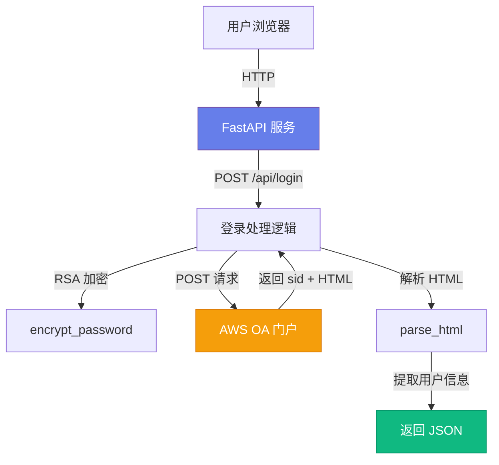
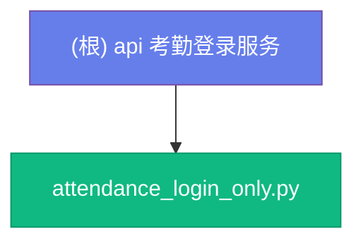

# 考勤登录服务（Attendance Login Only）

> 最后更新：2026-01-10 10:29:00

## 变更记录 (Changelog)

| 日期 | 版本 | 变更内容 |
|------|------|----------|
| 2026-01-10 | 1.0 | 初始化项目文档，由 init-architect 自动生成 |

---

## 项目愿景

这是一个**单点登录（SSO）代理服务**，用于简化企业 AWS OA 系统的登录流程。通过本服务，用户可以使用统一的 Web 界面登录考勤系统，服务负责处理 RSA 加密、会话管理和用户信息提取。

### 核心价值
- **简化登录体验**：提供友好的 Web 界面，隐藏底层 RSA 加密和 API 调用复杂性
- **安全增强**：使用 RSA 公钥加密密码，避免明文传输
- **用户信息提取**：自动解析登录后的 HTML 页面，提取用户 ID、姓名、部门信息
- **API 友好**：提供 REST API，便于其他系统集成

---

## 架构总览



### 技术栈
- **后端框架**：FastAPI (Python 3.8+)
- **加密库**：PyCryptodome (RSA/PKCS1_v1_5)
- **HTTP 客户端**：requests
- **服务器**：uvicorn
- **配置管理**：python-dotenv

---

## 模块结构图



---

## 模块索引

| 模块路径 | 职责 | 语言 | 入口文件 | 状态 |
|----------|------|------|----------|------|
| `/` | 单点登录服务核心 | Python | `attendance_login_only.py` | ✅ 活跃 |

> **说明**：本项目为单文件应用，所有功能集中在一个 Python 模块中。

---

## 运行与开发

### 环境要求
- Python 3.8+
- 依赖包：
  ```bash
  pip install fastapi uvicorn requests python-dotenv pycryptodome
  ```

### 配置环境变量
创建 `.env` 文件（项目根目录）：
```env
# AWS OA 系统配置
AWS_PORTAL_URL=https://your-oa-system.com
RSA_MODULUS_HEX=your_rsa_modulus_hex
RSA_EXPONENT=65537
```

**重要说明**：
- `RSA_MODULUS_HEX` 和 `RSA_EXPONENT` 需要从目标 OA 系统的前端 JavaScript 中提取
- 默认 `RSA_EXPONENT` 通常是 `65537` (0x10001)

### 启动服务
```bash
# 直接运行（自动查找可用端口）
python attendance_login_only.py

# 或指定端口
uvicorn attendance_login_only:app --host 0.0.0.0 --port 8000
```

### 访问服务
- **Web 登录页面**：http://localhost:8000
- **API 端点**：http://localhost:8000/api/login

---

## API 接口文档

### 1. POST /api/login
用户登录接口

**请求方式**：`POST`
**Content-Type**：`multipart/form-data`

**请求参数**：
| 字段 | 类型 | 必填 | 说明 |
|------|------|------|------|
| username | string | 是 | AWS OA 账号（工号） |
| password | string | 是 | 登录密码 |

**成功响应**（200 OK）：
```json
{
  "status": "success",
  "username": "12061413",
  "sid": "session_id_here",
  "html_content": "<html>...</html>",
  "user_info": {
    "id": "12061413",
    "name": "李茗",
    "department": "人工智能工作室"
  }
}
```

**失败响应**（401 Unauthorized）：
```json
{
  "detail": "用户名或密码错误"
}
```

### 2. GET / 或 GET /login
Web 登录页面

返回内嵌的 HTML 登录表单，提供友好的用户界面。

---

## 测试策略

### 手动测试
```bash
# 1. 启动服务
python attendance_login_only.py

# 2. 访问 Web 页面测试
# 打开浏览器访问 http://localhost:8000

# 3. API 测试（使用 curl）
curl -X POST http://localhost:8000/api/login \
  -F "username=YOUR_USERNAME" \
  -F "password=YOUR_PASSWORD"
```

### 建议添加的自动化测试
- [ ] 单元测试：`encrypt_password()` 函数
- [ ] 单元测试：`parse_html()` 函数（多种 HTML 格式）
- [ ] 集成测试：`do_login()` 端到端登录流程
- [ ] API 测试：FastAPI `/api/login` 接口
- [ ] Mock 测试：模拟 AWS OA 系统响应

---

## 编码规范

### Python 代码风格
- 遵循 **PEP 8** 规范
- 使用类型注解（Type Hints）提升代码可读性
- 函数使用中文注释说明用途
- 日志使用中文，便于运维排查

### 安全最佳实践
- ✅ 密码使用 RSA 加密后再传输
- ✅ 敏感配置通过环境变量管理
- ⚠️ **注意**：当前代码中 `html_content` 返回完整页面，可能包含敏感信息，生产环境建议移除
- ⚠️ **建议**：添加 HTTPS 支持（使用 nginx 反向代理）

---

## AI 使用指引

### 适合 AI 辅助的任务
1. **功能增强**：
   - 添加登录失败次数限制
   - 实现会话持久化（Redis/数据库）
   - 添加日志审计功能
   - 支持多语言（i18n）

2. **代码质量提升**：
   - 重构为模块化结构（分离路由、加密、HTML 解析）
   - 添加配置验证（Pydantic 模型）
   - 补充单元测试和集成测试

3. **安全性加固**：
   - 添加 CSRF 保护
   - 实现 Rate Limiting（限流）
   - 添加请求签名验证
   - 移除响应中的敏感 HTML 内容

4. **文档完善**：
   - 生成 OpenAPI/Swagger 文档
   - 添加部署文档（Docker/Kubernetes）
   - 编写故障排查指南

### 上下文理解要点
- **核心流程**：用户输入 → RSA 加密 → OA 系统认证 → 提取用户信息 → 返回结果
- **关键函数**：`encrypt_password()`、`do_login()`、`parse_html()`
- **依赖关系**：FastAPI → requests → AWS OA Portal
- **配置驱动**：所有外部系统配置通过环境变量注入

---

## 相关文件清单

### 核心文件
- `attendance_login_only.py` - 主程序（321 行）
  - 导入与配置（1-39 行）
  - 登录逻辑（40-158 行）
  - FastAPI 应用（159-320 行）

### 建议创建的文件
- `.env` - 环境变量配置（需手动创建）
- `requirements.txt` - Python 依赖清单
- `tests/` - 测试目录
- `README.md` - 项目说明文档
- `Dockerfile` - 容器化部署配置

---

## 常见问题 (FAQ)

### Q1: 如何获取 RSA 公钥参数？
**A**: 访问目标 OA 系统的登录页面，查看前端 JavaScript 代码，搜索 `RSA_MODULUS_HEX` 或类似变量。

### Q2: 登录后如何保持会话？
**A**: 当前实现返回 `sid`（会话 ID），后续请求需携带此参数。建议在生产环境中使用 Redis 或数据库存储会话。

### Q3: 为什么返回了 `html_content`？
**A**: 这是调试用途，便于查看登录后的页面内容。生产环境建议移除此字段以减少数据泄露风险。

### Q4: 如何部署到生产环境？
**A**:
1. 使用 nginx 作为反向代理（添加 HTTPS）
2. 使用 systemd/supervisor 管理进程
3. 配置环境变量文件（`.env`）
4. 添加日志轮转和监控

---

## 贡献者

- 项目初始化：init-architect (2026-01-10)
- 维护者：待补充

---

## 许可证

待补充
